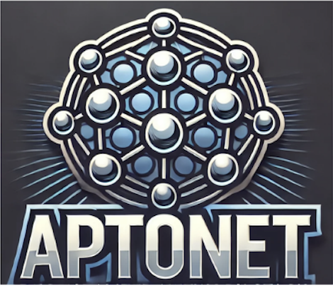
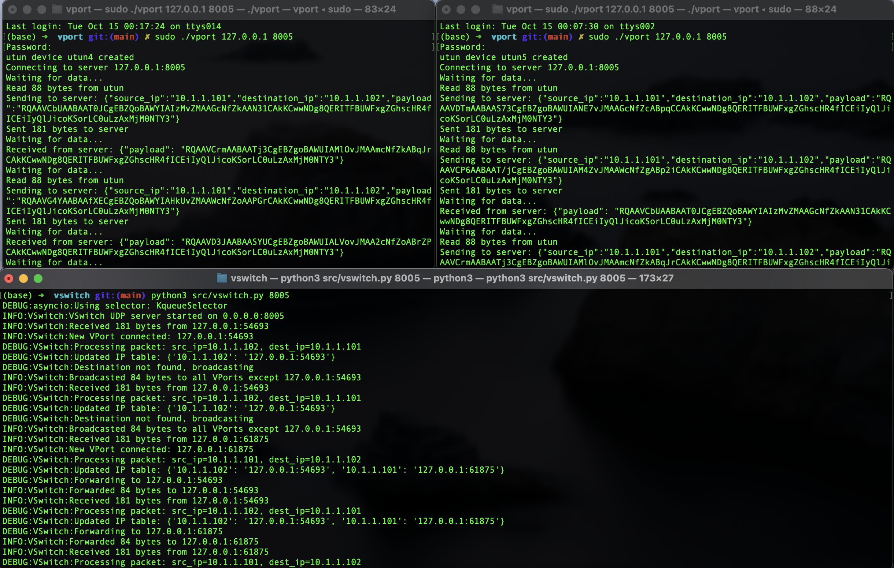
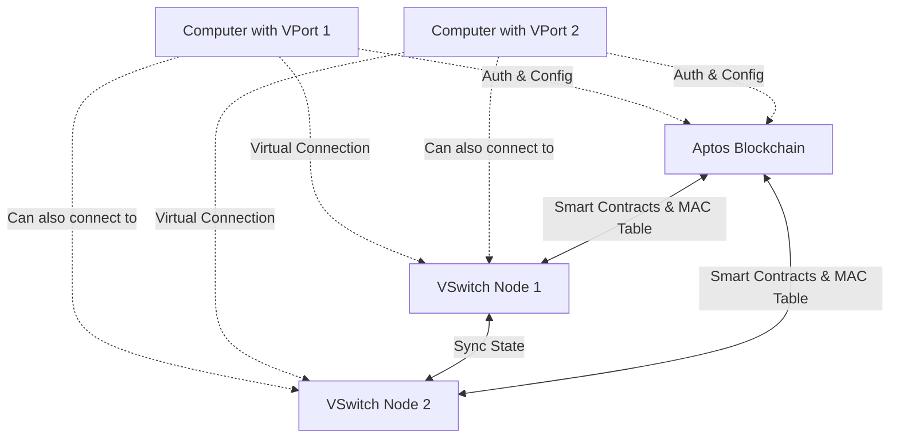

# AptoNet



**AptoNet** is world's first decentralized network stack built on the Aptos blockchain, designed to facilitate seamless communication across decentralized networks. This innovative project aims to revolutionize how devices and applications interact in a decentralized ecosystem, enabling efficient and secure connectivity while prioritizing user privacy and data integrity. By integrating low-level network functionalities with the unique capabilities of the Aptos blockchain, AptoNet addresses the growing demand for decentralized communication solutions.



## **Table of Contents**

- [Vision](#vision)
- [Features](#features)
- [Technology Architecture](#technology-architecture)
- [Business Model](#business-model)
- [Future Scope](#future-scope)
- [Technology Stack](#technology-stack)
- [Setup](#Setup)
- [How It Works](#How-It-Works)

- [Contact Information](#contact-information)


## Vision

At **AptoNet**, our vision is to create a decentralized communication framework that empowers users to communicate and transact without intermediaries, ensuring privacy, security, and reliability. We believe in a future where individuals and devices can interact seamlessly across networks, fostering innovation and collaboration in a decentralized landscape. Our vision encompasses several core principles:

- **Decentralized Connectivity**: AptoNet aims to eliminate central points of failure in communication, allowing users to connect directly with one another in a secure environment.

- **Enhanced User Privacy**: By leveraging the Aptos blockchain, AptoNet prioritizes user privacy, ensuring that data transmitted across the network remains confidential and tamper-proof.

- **Interoperability Across Platforms**: AptoNet is designed to be compatible with various decentralized applications (dApps) and services, fostering a collaborative ecosystem where developers can build innovative solutions on top of our framework.

- **User-Centric Approach**: We are committed to empowering users with control over their data and communications. AptoNet provides tools and functionalities that allow individuals to manage their interactions securely and efficiently.

- **Promoting Innovation**: By providing developers with a robust infrastructure for decentralized communication, we aim to spark innovation and creativity, leading to the development of new applications and services that benefit users globally.

## Features

### 1. **Decentralized Communication Protocol**
- Facilitates peer-to-peer communication without intermediaries, ensuring secure and direct connections.

### 2. **Low-Level Network Functionality**
- Provides essential networking functions such as address resolution, packet routing, and error handling, enabling developers to build robust applications.

### 3. **Blockchain Integration**
- Utilizes the Aptos blockchain for data integrity, security, and immutability, ensuring that all communication remains tamper-proof.

### 4. **Cross-Platform Compatibility**
- Supports multiple platforms, including web, mobile, and IoT devices, allowing for diverse use cases and applications.

### 5. **User Control Over Data**
- Empowers users to manage their data and communications, enhancing privacy and security.

### 6. **Real-Time Communication**
- Enables real-time messaging and data exchange between devices, supporting applications that require immediate feedback and interaction.

### 7. **Robust API for Developers**
- Offers a comprehensive API that allows developers to integrate AptoNet functionalities into their applications seamlessly.

### 8. **Scalable Infrastructure**
- Designed to handle high volumes of traffic and interactions, ensuring reliable performance as user demand grows.

## Technology Architecture

### Overall Architecture
The architecture of AptoNet illustrates the interaction between users, devices, and the Aptos blockchain, enabling efficient communication and data transfer.



## Business Model

AptoNet employs a multifaceted business model to ensure sustainable growth while delivering value to users and developers:

- **Decentralized Application (dApp) Marketplace**: AptoNet will establish a marketplace where developers can deploy their dApps built on the AptoNet infrastructure. This marketplace will facilitate easy access to innovative applications for users.

- **Premium Services for Businesses**: We will offer subscription-based premium services to businesses that wish to utilize AptoNet’s functionalities for their internal communication or customer interactions. This may include enhanced security features, priority support, and custom integrations.

- **Partnerships with Developers**: AptoNet will collaborate with developers and organizations interested in integrating decentralized communication into their platforms. Revenue will be generated through licensing agreements and partnership models.

- **Tokenomics and Incentives**: AptoNet will implement a tokenomics model where users can earn tokens by participating in the network, such as validating transactions or contributing to the ecosystem. These tokens can be used for accessing premium features or exchanged in the marketplace.

- **Data Privacy Consulting**: As businesses increasingly seek to comply with data protection regulations, AptoNet can offer consulting services to help organizations understand how to implement decentralized communication solutions while ensuring compliance with privacy standards.


## Future Scope

AptoNet is positioned for significant evolution and expansion in the upcoming years, with several key initiatives on our roadmap:

- **Enhanced Protocol Features**: We will continue to develop and refine our networking protocols, introducing features such as automatic network optimization and adaptive routing based on real-time conditions.

- **Integration with IoT Devices**: Future iterations of AptoNet will support integration with Internet of Things (IoT) devices, enabling decentralized communication between smart devices in homes and industries.

- **Cross-Chain Interoperability**: We plan to implement cross-chain functionalities that allow AptoNet to interact with other blockchains, broadening the scope of decentralized applications and services.

- **User Education and Onboarding**: We recognize the importance of user education in adopting new technologies. AptoNet will invest in creating educational resources, tutorials, and community outreach programs to facilitate user understanding and engagement.

- **Developer Ecosystem Growth**: We aim to cultivate a thriving developer community around AptoNet by providing comprehensive documentation, support channels, and incentivizing contributions through hackathons and developer grants.

- **Global Adoption Strategy**: AptoNet will pursue partnerships with organizations and communities worldwide to promote the adoption of decentralized communication, ensuring that our technology reaches diverse user bases.

- **Research and Development**: Continuous investment in research and development will ensure that AptoNet remains at the forefront of technological advancements, enabling us to introduce innovative features and maintain competitiveness in the market.

### Technology Stack

- **Blockchain Integration**:
  - **Aptos**: Leveraging the Aptos blockchain for data integrity, security, and immutability.

- **Networking Protocols**:
  - Custom-built networking protocols tailored for decentralized communication.

- **Development Framework**:
  - Built using **Rust** and **Move** for high-performance network operations and smart contract interactions on the Aptos blockchain.

- **Virtual Port Development**:
  - Utilizes **C** language for developing vPort, enhancing communication efficiency.

- **Virtual Switch Development**:
  - Created using **Python** for implementing a virtual switch (vSwitch) to manage network traffic.

- **Real-Time Communication**:
  - Utilizes **WebSocket** technology for real-time communication between devices.
  

## Setup

1. **Clone the Repository**

    ```bash
    git clone https://github.com/Programmer-Shivansh/AptoNet.git
    cd AptoNet
    ```

2. **Setup Blockchain**

    ```bash
    cd scripts
    aptos init 
    // Put the address obtained in the setup_blockchain.sh
    ./setup_blockchain.sh
    ```
    - Save the VPort Admin Address

3. **Deploy Smart Contracts**

    ```bash
    cd aptos/contracts

    cd mac_table 
    aptos init 
    // Put the address obtained in move.toml
    cd ../vport_management
    aptos init
    // Put the address obtained in move.toml

    cd ../scripts
    ./deploy_contracts.sh
    ```

    - This will compile and publish the VPort Management and MAC Table contracts to the Aptos blockchain.

4. **Configure and Run VSwitch Server**

    ```bash
    cd ../vswitch
    pip install -r requirements.txt
    python3 src/vswitch.py <SERVER_PORT>
    ```

    - Replace `<SERVER_PORT>` with your desired port number (e.g., `8000`).

5. **Build and Run VPort Clients**

    ```bash
    cd ../../vport
    make
    sudo ./vport <SERVER_IP> <SERVER_PORT>
    ```

    - Replace `<SERVER_IP>` with the VSwitch server's IP address and `<SERVER_PORT>` with the port number.

6. **Configure UTUN Devices**

    On each client machine:

    ```bash
    sudo ifconfig utun4 10.1.1.101 10.1.1.102 netmask 255.255.255.0 up
    sudo ifconfig utun5 10.1.1.102 10.1.1.101 netmask 255.255.255.0 up
    ```
    - Adjust the IP address as needed for each client.

7. **Test Connectivity**

    - Ping between clients to ensure connectivity:

    ```bash
    ping 10.1.1.102  # From Client-1 to Client-2
    ping 10.1.1.101  # From Client-2 to Client-1
    ```


## How It Works

1. **VPort Registration and Authentication**

    - VPorts register with the VSwitch server via the Aptos blockchain.
    - Smart contracts handle authentication, ensuring only authorized VPorts can connect.

2. **Decentralized MAC Address Management**

    - The MAC address table is stored on the Aptos blockchain.
    - VSwitch nodes read from and write to the blockchain to maintain a consistent view of the network.

3. **Ethernet Frame Forwarding**

    - VSwitch nodes manage Ethernet frame exchanges based on the decentralized MAC table.
    - Frames are forwarded to the appropriate VPort clients or broadcasted as needed.

## Additional Information

- **Smart Contracts**: Located in `aptos/contracts/`.
- **VSwitch Server Code**: Located in `vswitch/src/`.
- **VPort Client Code**: Located in `vport/src/`.


## Contact Information

For inquiries, support, or collaboration opportunities, please contact us at:

- **Email**: shivanshchauhan2005@gmail.com

